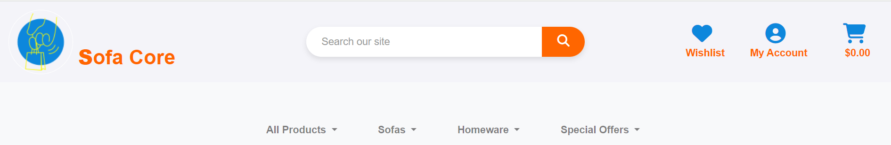
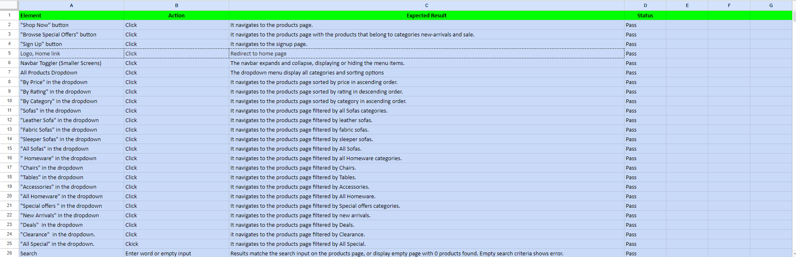

# Sofa Core

 [Sofa Core](https://zeitshoop1-c40db427d283.herokuapp.com/)

Sofa Core is an online platform designed to offer a diverse range of furniture options, allowing users to browse, review, and purchase high-quality sofas. The platform aims to provide a seamless shopping experience, making it easy for users to find the perfect sofa for their needs. With a wide selection of styles, materials, and prices, Sofa stands out by offering detailed product descriptions, user reviews, and personalized recommendations.
____

____
## User Experience (UX)
A visitor to Sofa is typically an adult who values comfort and style in their living space. They have a keen interest in interior design and enjoy exploring various furniture options to enhance the aesthetics and functionality of their home. Sofa aims to cater to individuals who want to elevate their living environment with high-quality sofas that combine both comfort and elegance. Whether they are seeking inspiration for a cozy living room setup or looking to expand their furniture collection, Sofa provides a comprehensive platform tailored to meet the needs of home enthusiasts who value both style and comfort. The platform ensures a seamless shopping experience, making it easy to find the perfect sofa that fits their personal taste and home decor.

## Follow link for [User Stories](https://github.com/XOZANAYKUT/zeit_shop/issues)

## Existing Features
____
 
### Navigation Bar
- The fully responsive navigation bar on all pages contains links to the home page, wishlist, search button, registration, bag, login pages and is present on every page to allow easy navigation.

- This section will allow users to easily find their desired products through easily accessible buttons. It ensures that users can navigate seamlessly from page to page across all devices, providing a smooth and intuitive browsing experience.

- This section will allow the user to easily navigate from page to page on all devices without having to go back to the product pages they want through the downloadable buttons below.

____
## Landing Page Image
- Sofa Core's homepage contains basic product information as well as images and information highlighting the company's areas of expertise. When a user clicks on a product URL, they are directed to a page that provides detailed information about the products. In addition, on this page, users can add, delete and rate comments about the product, as well as add the product to their wishlist, thus enabling interactive interaction. 
- The visual elements effectively emphasise the company's areas of expertise, creating an engaging and informative experience for visitors.

____
 ### The Footer
 - The footer section of Sofa Core's website includes links to social media platforms that allow users to easily connect and stay up to date, as well as links to products for easy access. These links are designed to open in a new tab, ensuring smooth navigation for users.  
 -Social media icons are also prominently displayed, encouraging users to interact with sofa Core content on various platforms.

____
### Search
 "Search Section": The Sofa Core website has a search button that allows users to easily find the products they are looking for by entering keywords. Users can enter keywords to search. If search results are found, users can quickly access the results. However, if no results are found, users are notified with a message that no results were found. This provides a user-friendly experience.
 ____

____
### Search Result
- If the search results are found or not, the result of the search is shown in this section.
____

____

____
### Register
- Registering for Sofa Core is easy! Here, they can enjoy many benefits by creating a personalised account. All they have to do is choose a username, provide an email address and choose a strong password and confirm their email address with a confirmation message. Then, they can create their account and embark on an adventure filled with marvellous products from around the world. After signing up, they can have an easier navigation and discover much more.

___
### Login
- After logged in, users can browse reviews and wish lists, rate, leave their own feedback, and explore additional features on the site.

____

### Shopping Bag
-  In the Shopping Bag section, you can add the products you like and the prices of the products are automatically calculated and you can increase the number of products and remove or update the product and when you want to buy the product, you can go directly to the order form directly after entering the information after entering the information that the order has been placed and detailed information is given with a thank you message.

____

____

____

### Wishlist
____
when each product is clicked, add wish list and remove wish list buttons are available, when the buttons are clicked, the desired function is performed and thus the desired product can be found easily in the future.
____

____

____

____
### Sorting
____
By offering certain options in the Sorting section . when the desired category is clicked, the desired result is more easily extracted and the result is given.
____

____

____

### Product Management
After entering the required information in the product management section, the product can be uploaded, edited and deleted, and a message is displayed on the page showing that these operations have been done successfully. However, this is a process that can only be done by the administrator.
____

____ 

____

____

____

## Features Left to Implement
- To integrate a calendar for booking calls
- An application form for the internship programme
- Applying online for the course
- 

____

## Performance For Mobile

### Home page performance

____

### Courses  page performance

____
### About  page performance

____

### Search page performance

____

____

### Register page performance

____
### Login page performance

____
### Logout page performance

____

## Performance For Desktop

### Home page performance

____
### Courses  page performance

____

### About  page performance

____

### Search page performance

____

____

### Register page performance

____

### Login page performance

____
### Logout page performance

____

## Data Model

- The Django model definitions provided down create models for a course and comments. The "Course" model represents a course created by a user, while the "Comment" model represents comments made on courses.

### The Course model has the following fields:

- title: The title of the course.
- slug: A unique URL tag for the course.
- author: A foreign key representing the author of the course. When a user is deleted, their associated courses are  automatically deleted.
- featured_image: The featured image for the course.
- content: The content of the course.
- date: The date of the course.
- duration: The duration of the course, which can be short-term or long-term.
- created_on: The date when the course was created.
- status: The status of the course, which can be draft or published.
- excerpt: A summary of the course.
- updated_on: The date when the course information was last updated.
____
## The Comment model has the following fields:

- course: A foreign key representing the course to which the comment is attached. When a course is deleted, associated comments are automatically deleted.
- author: A foreign key representing the author of the comment. When a user is deleted, their associated comments are automatically deleted.
- body: The content of the comment.
- approved: The approval status of the comment. By default, comments are set as unapproved.
- created_on: The date when the comment was create

## The About  model has the following fields:

- title: A CharField representing the title of the about section.
- updated_on: A DateTimeField automatically updated with the current date and time whenever the model is saved.
- profile_image: A CloudinaryField representing the image associated with the about section. It has a default value of 'placeholder'.
- content: A TextField containing the detailed content or description.
## model has the following fields:

- name: A CharField representing the name of the person making the collaboration request.
- email: An EmailField representing the email address of the person making the collaboration request.
- message: A TextField containing the message or details of the collaboration request.
- read: A BooleanField indicating whether the collaboration request has been read or not. It has a default value of False.
____
 
____
## Validator Testing
- HTML: No errors were found when passing through the official [W3C validator](https://validator.w3.org/nu/?doc=https%3A%2F%2Fprojectfour-1535055a6d4c.herokuapp.com%2F)
 - CSS: No errors found when passing through the official [(Jigsaw](https://jigsaw.w3.org/css-validator/validator?uri=https%3A%2F%2Fprojectfour-1535055a6d4c.herokuapp.com%2F&profile=css3svg&usermedium=all&warning=1&vextwarning=&lang=en)
 
  
 ## Javascript
- No errors found when passing through the official [jshint ](https://jshint.com/)
____
## Python 
- No errors found when passing through the official [pep8ci ](https://pep8ci.herokuapp.com/)
____

## Device Testing
- The website was viewed on a variety of devices such as Desktop, Laptop, iPhone 8, iPhoneXR and iPad to ensure responsiveness on various screen sizes in both portrait and landscape mode. The website performed as intended. The responsive design was also checked using Chrome developer tools across multiple devices with structural integrity holding for the various sizes.
____

## Manual Testing
 
 
 
 
 
 
____

## Deployment - Heroku

To deploy this page to Heroku from its GitHub repository, the following steps were taken:

### Create the Heroku App:

- Log in to [Heroku](https://id.heroku.com/) or create an account.
- On the main page click the button labelled New in the top right corner and from the drop-down menu select "Create 
- New App".
- Enter a unique and meaningful app name.
- Next select your region.
- Click on the Create App button.

### Attach the Postgres database:
-  In the Resources tab, under add-ons, type in Postgres and select the Heroku Postgres option.
-  Copy the DATABASE_URL located in Config Vars in the Settings Tab.

### Prepare the environment and settings.py file:
- In your GitPod workspace, create an env.py file in the main directory.
- Add the DATABASE_URL value and your chosen SECRET_KEY value to the env.py file.
- Update the settings.py file to import the env.py file and add the SECRETKEY and DATABASE_URL file paths.
- Comment out the default database configuration.
- Save files and make migrations.
- Add Cloudinary URL to env.py
- Add the cloudinary libraries to the list of installed apps.
- Add the STATIC files settings - the url, storage path, directory path, root path, media url and default file 
 storage path.
- Link the file to the templates directory in Heroku.
- Change the templates directory to TEMPLATES_DIR
- Add Heroku to the ALLOWED_HOSTS list the format ['app_name.heroku.com', 'localhost']

### Create files / directories
- Create requirements.txt file
- Create three directories in the main directory; media, storage and templates.
- Create a file named "Procfile" in the main directory and add the following: web: gunicorn project-name.wsgi

###
Add the following Config Vars in Heroku:

- SECRET_KEY value
- CLOUDINARY_URL
- PORT = 8000
- DISABLE_COLLECTSTATIC = 1
- DATABASE_URL 

### Deploy

- NB: Ensure in Django settings, DEBUG is False
- Go to the deploy tab on Heroku and connect to GitHub, then to the required repository.
- Scroll to the bottom of the deploy page and either click Enable Automatic Deploys for automatic deploys or Deploy - Branch to deploy manually. Manually deployed branches will need re-deploying each time the repo is updated.
- Click View to view the deployed site.
- The site is now live and operational.

    + [Local Deployment](#local-deployment)
    + [Heroku Deployment](#heroku-deployment)-
    + [django-aullauth Setup](#django-aullauth-setup)
    + [cloudinary Setup](#cloudinary-Setup)
    + [ElephantSQL Setup](#ElephantSQL-Setup)

- The live link for Heroku can be found here - https://projectfour-1535055a6d4c.herokuapp.com/
   
____
## Credits

### Content
-  Instructions on how to apply form verification on the Register page are taken from 
[Btkakademi](https://www.btkakademi.gov.tr)
[Bootstrap](https://getbootstrap.com/)
[w3schools](https://www.w3schools.com/)

### Media
- Images used on homepage and registration page are taken from [instagram](https://www.instagram.com/)

- The image used for the About Us page was taken from[instagram](https://www.instagram.com/)
  
- The image used for the return page was taken from the website [instagram](https://www.instagram.com/)

- Favicon was downloaded at [Icons8](https://icons8.com/icons/set/book)

- Icons in the Login taken from
[Font Awesome](https://fontawesome.com)

- Icons in the footer taken from
[Font Awesome](https://fontawesome.com)