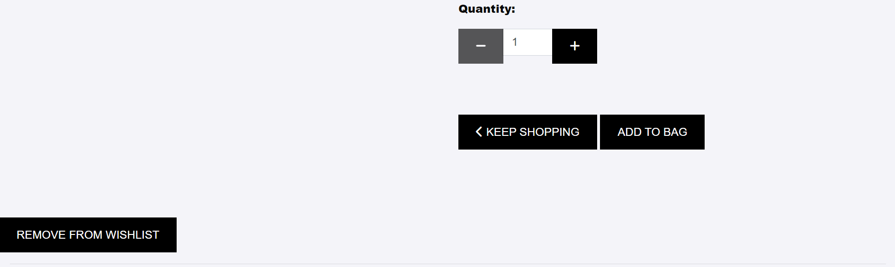
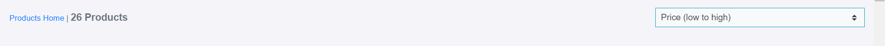

# Sofa Core

 [Sofa Core](https://zeitshoop1-c40db427d283.herokuapp.com/)

Sofa Core is an online platform designed to offer a diverse range of furniture options, allowing users to browse, review, and purchase high-quality sofas. The platform aims to provide a seamless shopping experience, making it easy for users to find the perfect sofa for their needs. With a wide selection of styles, materials, and prices, Sofa stands out by offering detailed product descriptions, user reviews, and personalized recommendations.
____

____
## User Experience (UX)
A visitor to Sofa is typically an adult who values comfort and style in their living space. They have a keen interest in interior design and enjoy exploring various furniture options to enhance the aesthetics and functionality of their home. Sofa aims to cater to individuals who want to elevate their living environment with high-quality sofas that combine both comfort and elegance. Whether they are seeking inspiration for a cozy living room setup or looking to expand their furniture collection, Sofa provides a comprehensive platform tailored to meet the needs of home enthusiasts who value both style and comfort. The platform ensures a seamless shopping experience, making it easy to find the perfect sofa that fits their personal taste and home decor.

## Follow link for [User Stories](https://github.com/XOZANAYKUT/zeit_shop/issues)

## Existing Features
____
 
### Navigation Bar
- The fully responsive navigation bar on all pages contains links to the home page, wishlist, search button, registration, bag, login pages and is present on every page to allow easy navigation.

- This section will allow users to easily find their desired products through easily accessible buttons. It ensures that users can navigate seamlessly from page to page across all devices, providing a smooth and intuitive browsing experience.

- This section will allow the user to easily navigate from page to page on all devices without having to go back to the product pages they want through the downloadable buttons below.

____
## Landing Page Image
- Sofa Core's homepage contains basic product information as well as images and information highlighting the company's areas of expertise. When a user clicks on a product URL, they are directed to a page that provides detailed information about the products. In addition, on this page, users can add, delete and rate comments about the product, as well as add the product to their wishlist, thus enabling interactive interaction. 
- The visual elements effectively emphasise the company's areas of expertise, creating an engaging and informative experience for visitors.

____
 ### The Footer
 - The footer section of Sofa Core's website includes links to social media platforms that allow users to easily connect and stay up to date, as well as links to products for easy access. These links are designed to open in a new tab, ensuring smooth navigation for users.  
 -Social media icons are also prominently displayed, encouraging users to interact with sofa Core content on various platforms.

____
### Search
 "Search Section": The Sofa Core website has a search button that allows users to easily find the products they are looking for by entering keywords. Users can enter keywords to search. If search results are found, users can quickly access the results. However, if no results are found, users are notified with a message that no results were found. This provides a user-friendly experience.
 ____

____
### Search Result
- If the search results are found or not, the result of the search is shown in this section.
____

____

____
### Register
- Registering for Sofa Core is easy! Here, they can enjoy many benefits by creating a personalised account. All they have to do is choose a username, provide an email address and choose a strong password and confirm their email address with a confirmation message. Then, they can create their account and embark on an adventure filled with marvellous products from around the world. After signing up, they can have an easier navigation and discover much more.

___
### Login
- After logged in, users can browse reviews and wish lists, rate, leave their own feedback, and explore additional features on the site.

____

### Shopping Bag
-  In the Shopping Bag section, you can add the products you like and the prices of the products are automatically calculated and you can increase the number of products and remove or update the product and when you want to buy the product, you can go directly to the order form directly after entering the information after entering the information that the order has been placed and detailed information is given with a thank you message.

____

____

____

### Wishlist
____
when each product is clicked, add wish list and remove wish list buttons are available, when the buttons are clicked, the desired function is performed and thus the desired product can be found easily in the future.
____

____

____

____
### Sorting
____
By offering certain options in the Sorting section . when the desired category is clicked, the desired result is more easily extracted and the result is given.
____

____

____

### Product Management
After entering the required information in the product management section, the product can be uploaded, edited and deleted, and a message is displayed on the page showing that these operations have been done successfully. However, this is a process that can only be done by the administrator.
____

____ 

____

____

____
### Rating
Rating system for the purchased product is shown with 5 stars. also the points given give information about the product to other users. the user can delete the score given and can score again.
____

____

____

____

### Comment
There is a comment system for the purchased product. also the comments made inform other users about the products. the user can delete, edit and make more than one comment. After each transaction, a message is given that the transaction has taken place.
____

____
 
____
 
____
 
____
 
## Features Left to Implement
-

____

## Performance For Desktop

### Home page performance

____

### Products  page performance

____

____
### wishlist  page performance

____
### Product Management  page performance
____

____
### Edit comment page performance
____

____
### My Profile  page performance

____
### logout  page performance

____
### Sing up

____
### Login  page performance

____
### bag  page performance

____
### Checkout  page performance

## Performance For Mobile

### Home page performance

____

### Products  page performance

____

____
### wishlist  page performance

____
### Product Management  page performance
____

____
### Edit comment page performance 
____

____
### My Profile  page performance

____
### logout  page performance

____
### Sing up  page performance

____
### Login  page performance

____
### bag  page performance

____
### Checkout  page performance

## Data Model

- The Django model definitions given below create models for Order,OrderLineItem, product, rating, UserProfile and comment. 

### Order Model
The Order model has the following fields:

- order_number: A unique identifier for the order, generated using UUID.
- user_profile: A foreign key representing the profile of the user who placed the order. If the user profile is - - - deleted, the reference is set to null.
- full_name: The full name of the person who placed the order.
- email: The email address of the person who placed the order.
- phone_number: The phone number of the person who placed the order.
- country: The country of the delivery address, represented using the CountryField.
- postcode: The postal code of the delivery address.
- town_or_city: The town or city of the delivery address.
- street_address1: The primary street address.
- street_address2: The secondary street address (optional).
- county: The county or region of the delivery address (optional).
- date: The date and time when the order was placed, automatically set when the order is created.
- delivery_cost: The cost of delivering the order.
- order_total: The total cost of the order before adding the delivery cost.
- grand_total: The total cost of the order including delivery.
- original_bag: A text field storing the original shopping bag content.
- stripe_pid: A field for storing the Stripe payment ID.
### Methods:

- _generate_order_number(): Generates a random, unique order number using UUID.
- update_total(): Updates the grand total each time a line item is added, accounting for delivery costs.
- save(*args, **kwargs): Overrides the original save method to set the order number if it hasn't been set already.
- __str__(): Returns the order number as the string representation of the order.

### OrderLineItem Model
The OrderLineItem model has the following fields:

- order: A foreign key representing the order to which the line item belongs. When the order is deleted, associated line items are also deleted.
- product: A foreign key representing the product included in the line item. When the product is deleted, the associated line item is also deleted.
- quantity: The quantity of the product ordered.
- lineitem_total: The total cost of the line item, calculated as product price times quantity.

### Methods:

- save(*args, **kwargs): Overrides the original save method to set the line item total and update the order total.
- __str__(): Returns a string indicating the SKU of the product and the order number to which the line item belongs.-
____
## Category Model
The Category model has the following fields:

- name: The name of the category.
- friendly_name: A user-friendly name for the category, which can be null or blank.
### Methods:

- __str__(): Returns the name of the category.
- get_friendly_name(): Returns the friendly name of the category.
### Meta Class:

- verbose_name_plural: Specifies the plural name for the model in the admin interface.

### Product Model
The Product model has the following fields:

- category: A foreign key linking to the Category model. If the category is deleted, the reference is set to null.
- sku: The stock-keeping unit identifier for the product, which can be null or blank.
- name: The name of the product.
- description: A text field for the product description.
- price: The price of the product.
- image_url: A URL for the product's image, which can be null or blank.
- image: An image file for the product, which can be null or blank.
- wishlist: A many-to-many relationship with the User model, representing users who have added the product to their wishlist.
### Methods:

- __str__(): Returns the name of the product.
- average_rating(): Calculates and returns the average rating of the product based on the associated Rating model instances. Returns 0 if no ratings exist.
### Rating Model
The Rating model has the following fields:

- product: A foreign key linking to the Product model. When the product is deleted, associated ratings are also deleted.
- user: A foreign key linking to the User model. When the user is deleted, associated ratings are also deleted.
- score: An integer field representing the rating score, chosen from predefined choices ranging from 1 to 5 stars.
# Methods:

- __str__(): Returns a string representation of the rating, including the score, product name, and username of the rater.
### Score Choices:

- ONE_STAR: 1 star
- TWO_STARS: 2 stars
- THREE_STARS: 3 stars
- FOUR_STARS: 4 stars
- FIVE_STARS: 5 stars
- Comment Model
The Comment model has the following fields:

- product: A foreign key linking to the Product model, representing the product to which the comment is attached. When the product is deleted, associated comments are also deleted.
- author: A foreign key linking to the User model, representing the author of the comment. When the user is deleted, associated comments are also deleted.
- body: The content of the comment.
- created_on: The date and time when the comment was created, automatically set when the comment is created.
### Methods:
____

- __str__(): Returns a string representation of the comment, including the comment body and the author's username.
### Meta Class:

- ordering: Specifies the default ordering of comments by the creation date in ascending order.
____
## UserProfile Model
____
The UserProfile model has the following fields:

- user: A one-to-one relationship with the User model, representing the user associated with the profile.
- default_phone_number: The default phone number for the user, which can be null or blank.
- default_street_address1: The first line of the default street address for the user, which can be null or blank.
- default_street_address2: The second line of the default street address for the user, which can be null or blank.
- default_town_or_city: The default town or city for the user, which can be null or blank.
- default_county: The default county or state for the user, which can be null or blank.
- default_postcode: The default postal code for the user, which can be null or blank.
- default_country: The default country for the user, which can be null or blank.
____
### Methods:

- __str__(): Returns the username of the user associated with the profile.
____
### Signal for Creating/Updating UserProfile
____
- A signal is defined to create or update a UserProfile instance whenever a User instance is created or updated.

- create_or_update_user_profile(sender, instance, created, **kwargs): Creates a UserProfile instance when a new User - instance is created, and saves the UserProfile instance when an existing User instance is updated.
### Receiver:
____
- post_save: This signal is connected to the create_or_update_user_profile function, ensuring the user profile is created or updated appropriately when a User instance is saved.
____
 
____
## Validator Testing
- HTML: No errors were found when passing through the official [W3C validator](https://validator.w3.org/nu/?showsource=yes&doc=https%3A%2F%2Fzeitshoop1-c40db427d283.herokuapp.com%2F#l338c35)
 - CSS: No errors found when passing through the official [(Jigsaw](https://jigsaw.w3.org/css-validator/validator?uri=https%3A%2F%2Fzeitshoop1-c40db427d283.herokuapp.com%2F&profile=css3svg&usermedium=all&warning=1&vextwarning=&lang=en)
 ____
 
  
 ## Javascript
 ____
- No errors found when passing through the official [jshint ](https://jshint.com/)
____
## Python 
____
- No errors found when passing through the official [pep8ci ](https://pep8ci.herokuapp.com/)
____

## Device Testing
____
- The website was viewed on a variety of devices such as Desktop, Laptop, iPhone 8, iPhoneXR and iPad to ensure responsiveness on various screen sizes in both portrait and landscape mode. The website performed as intended. The responsive design was also checked using Chrome developer tools across multiple devices with structural integrity holding for the various sizes.
____

## Manual Testing
____
 
 
 
 

____

## Deployment - Heroku

To deploy this page to Heroku from its GitHub repository, the following steps were taken:

### Create the Heroku App:

- Log in to [Heroku](https://id.heroku.com/) or create an account.
- On the main page click the button labelled New in the top right corner and from the drop-down menu select "Create 
- New App".
- Enter a unique and meaningful app name.
- Next select your region.
- Click on the Create App button.

### Attach the Postgres Database:
- In the Resources tab on Heroku, under add-ons, type in Postgres and select the Heroku Postgres option.
- Copy the DATABASE_URL located in Config Vars in the Settings Tab.
### Prepare the Environment and settings.py File:
- In your GitPod workspace, create an env.py file in the main directory.
- Add the DATABASE_URL value and your chosen SECRET_KEY value to the env.py file.
- Update the settings.py file to import the env.py file and add the SECRET_KEY and DATABASE_URL file paths.
- Comment out the default database configuration.
- Save files and make migrations.
- Add Cloudinary URL to env.py.
- Add the Cloudinary libraries to the list of installed apps.
- Add the STATIC files settings - the URL, storage path, directory path, root path, media URL, and default file storage path.
- Link the file to the templates directory in Heroku.
- Change the templates directory to TEMPLATES_DIR.
- Add Heroku to the ALLOWED_HOSTS list in the format ['app_name.heroku.com', 'localhost'].

### Create files / directories
- Create requirements.txt file
- create robots.txt
- create runtime txt.
- create sitemap.xml
- Create four directories in the main directory; Static, docs, storage and templates.
- Create a file named "Procfile" in the main directory and add the following: web: gunicorn project-name.wsgi
- create a file named "env.py".
###
Add the following Config Vars in Heroku:

 

### Deploy

- NB: Ensure in Django settings, DEBUG is False
- Go to the deploy tab on Heroku and connect to GitHub, then to the required repository.
- Scroll to the bottom of the deploy page and either click Enable Automatic Deploys for automatic deploys or Deploy - Branch to deploy manually. Manually deployed branches will need re-deploying each time the repo is updated.
- Click View to view the deployed site.
- The site is now live and operational.

    + [Local Deployment](#local-deployment)
    + [Heroku Deployment](#heroku-deployment)-
    + [django-aullauth Setup](#django-aullauth-setup)
    + [cloudinary Setup](#cloudinary-Setup)
    + [ElephantSQL Setup](#ElephantSQL-Setup)
    + [AWS Setup](#AWS-Setup)

- The live link for Heroku can be found here - https://zeitshoop1-c40db427d283.herokuapp.com/
   
____
## Credits

### Content
-  Instructions on how to apply form verification on the Register page are taken from 
[Btkakademi](https://www.btkakademi.gov.tr)
[Bootstrap](https://getbootstrap.com/)
[w3schools](https://www.w3schools.com/)

### Media
- Images used on homepage and registration page are taken from [google](https://www.beliani.de/)
- Favicon was downloaded at [Icons8](https://icons8.com/icons/set/book)
- Icons in the Login taken from
[Font Awesome](https://fontawesome.com)
- Icons in the footer taken from
[Font Awesome](https://fontawesome.com)